# ☁️ Cloud Storage Application

A modern full-stack cloud storage application for securely managing, organizing, sharing, and accessing files online.

---

## 📌 Introduction

This project is a full-stack cloud storage platform inspired by modern file management systems such as Google Drive.

Users can:

* Create and manage folders
* Upload and download files
* View and edit supported files
* Rename and move files and folders
* Move files and folders to trash
* Share files with other users through email
* Assign Viewer or Editor permissions
* Create password-protected public sharing links
* Manage shared files
* Receive notifications for important sharing activities

---

## 🔗 Live Links

### Frontend

https://cloud-storage-tawny.vercel.app

### Backend

https://cloud-storage-ynj7.onrender.com

---

## 📸 Screenshots

### 🔐 Login

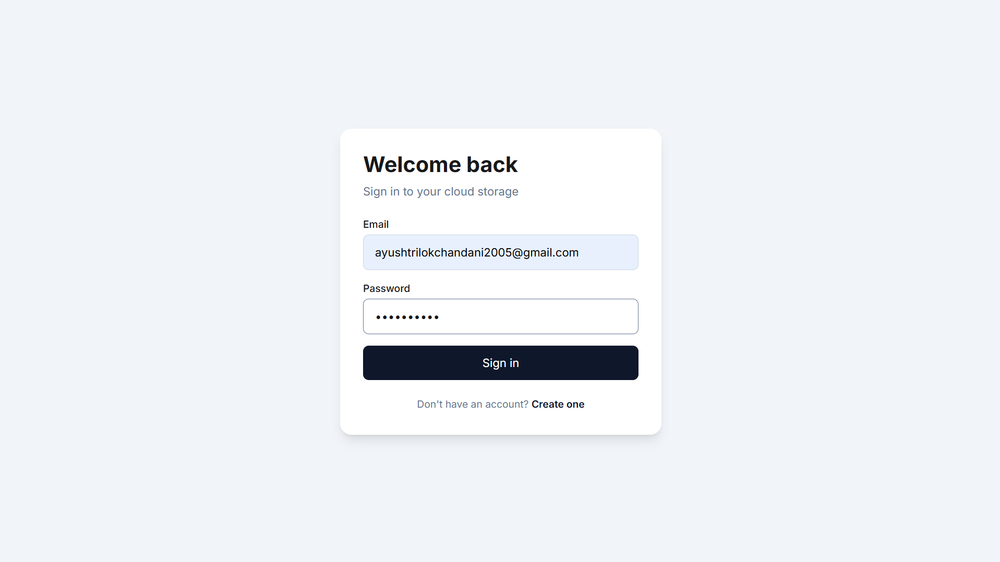

### 📝 Registration

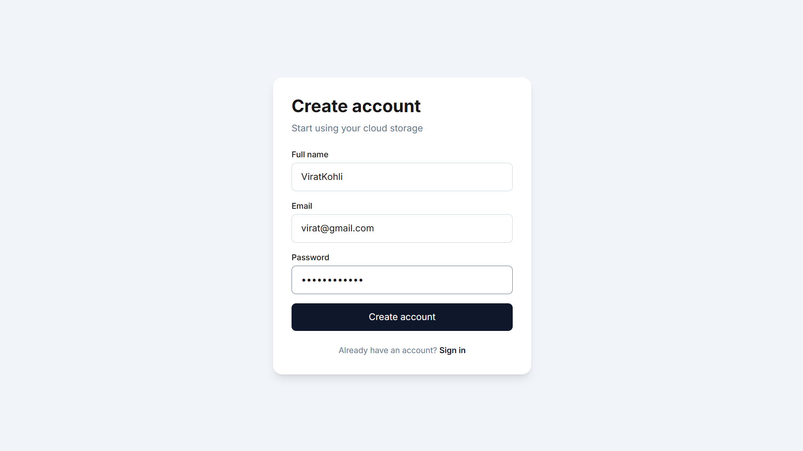

### 📊 Dashboard

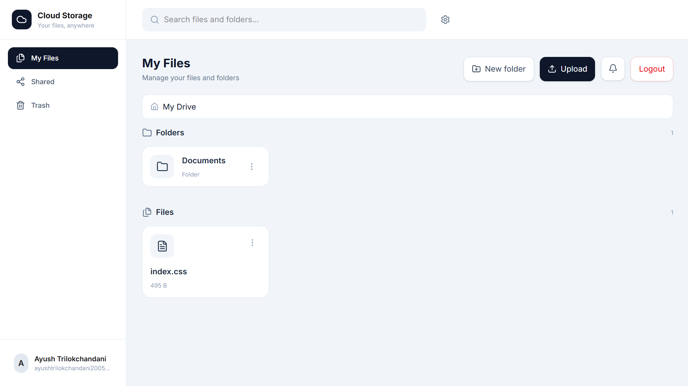

### 📄 File Actions

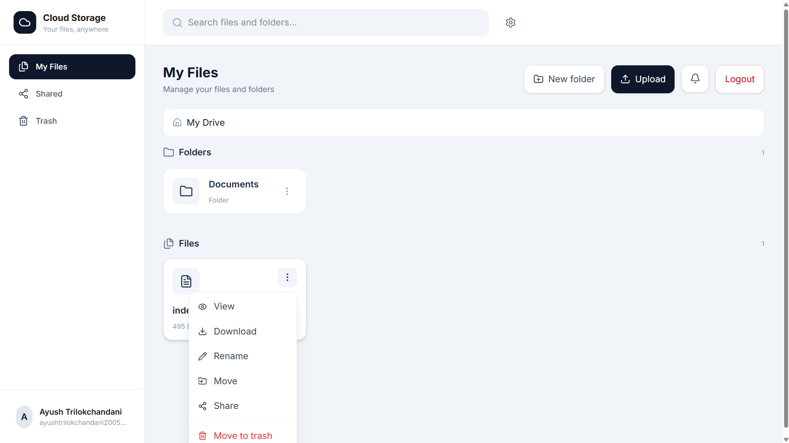

### 📁 Folder Actions

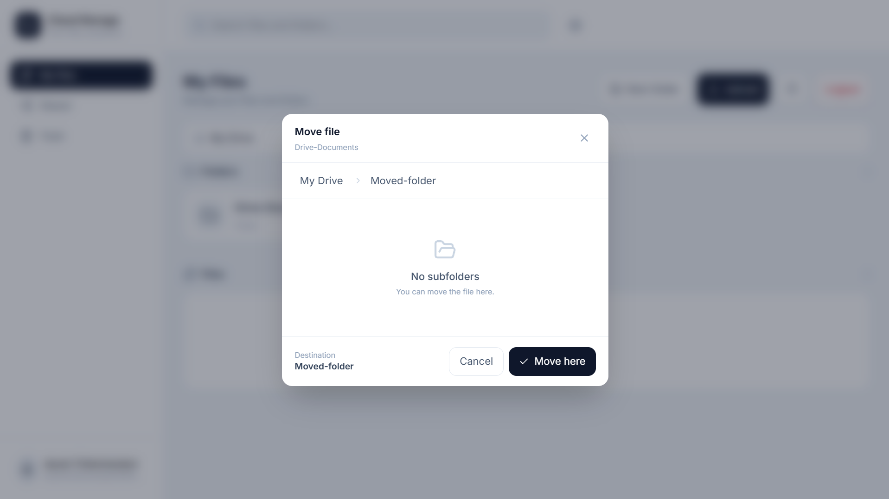
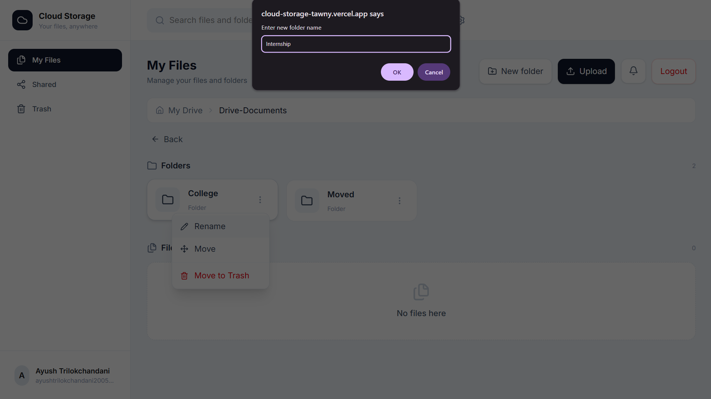
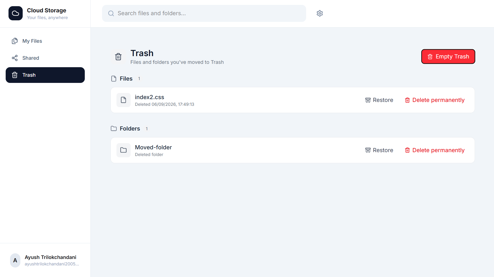

### 🤝 File Sharing

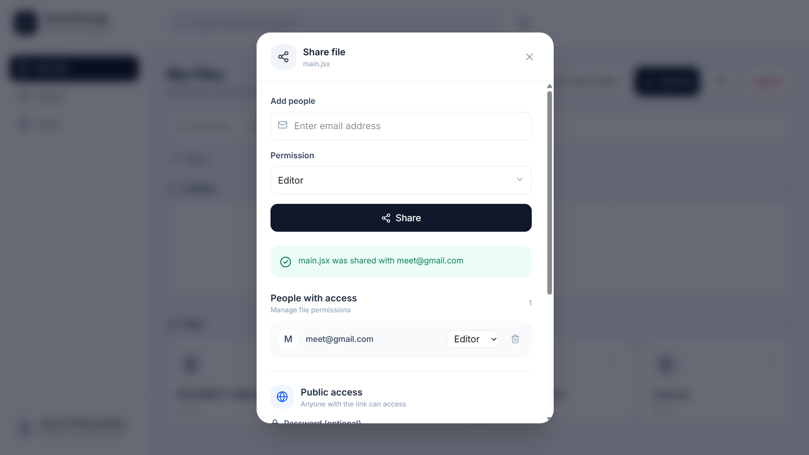

### 📂 Shared Files

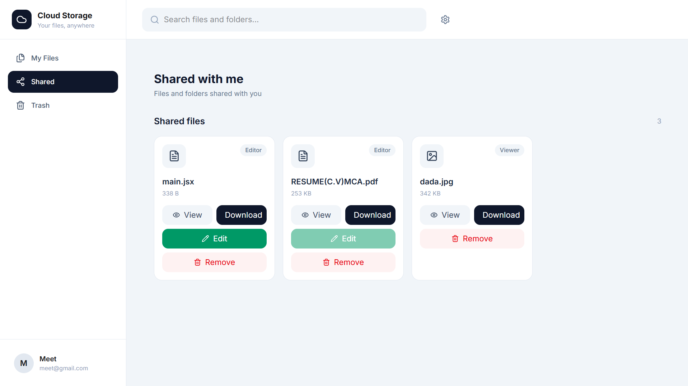

### 🔗 Public Sharing

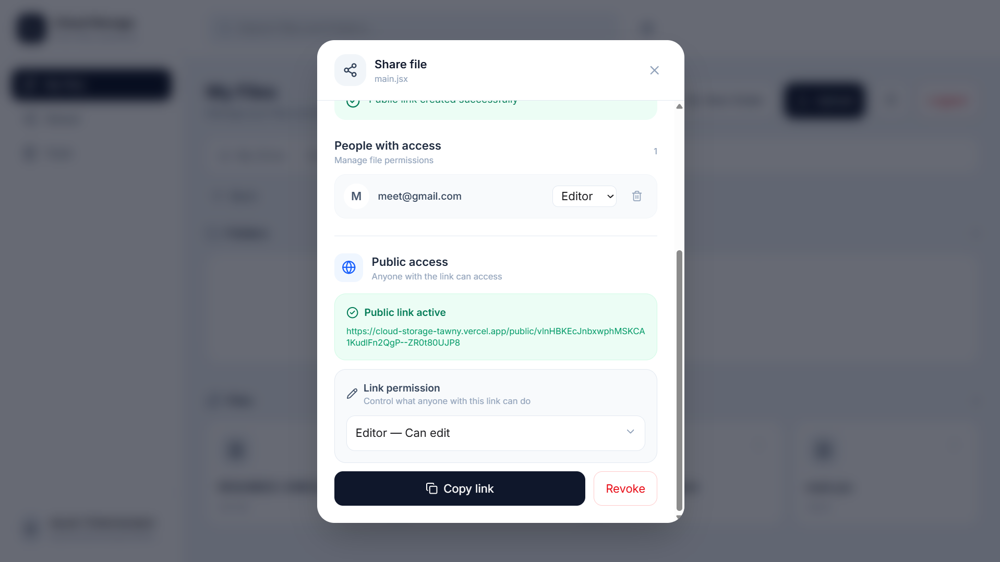
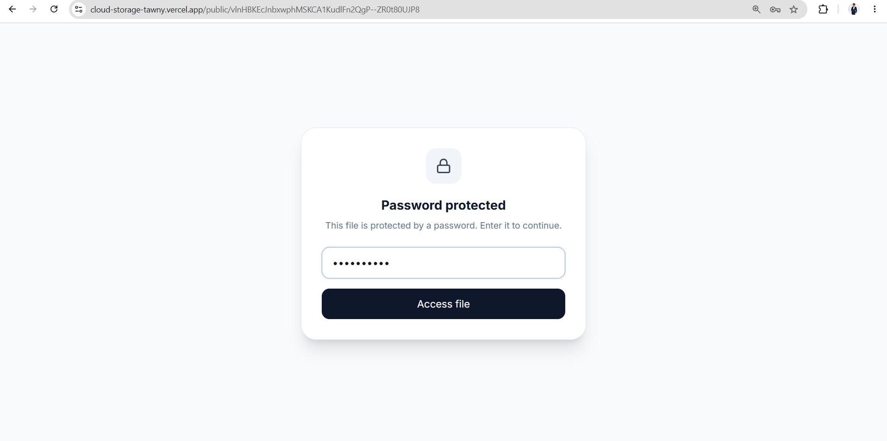
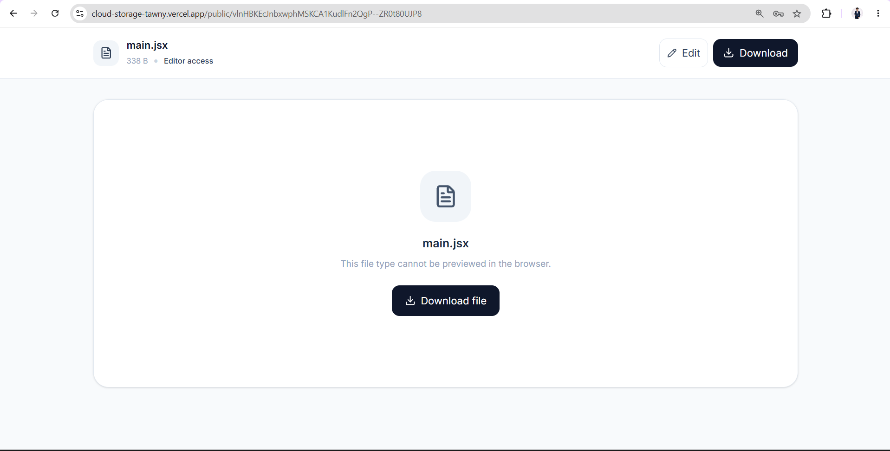    
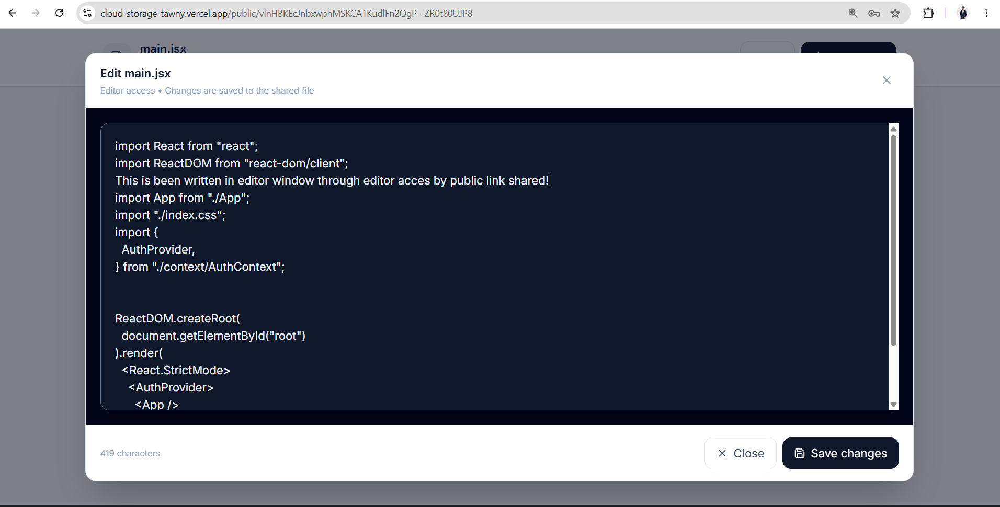

### 🔔 Notifications

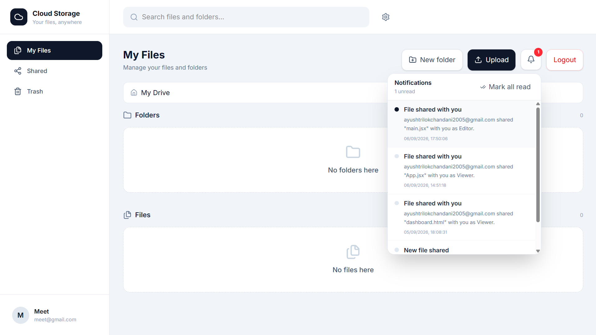

### 🗑️ Trash

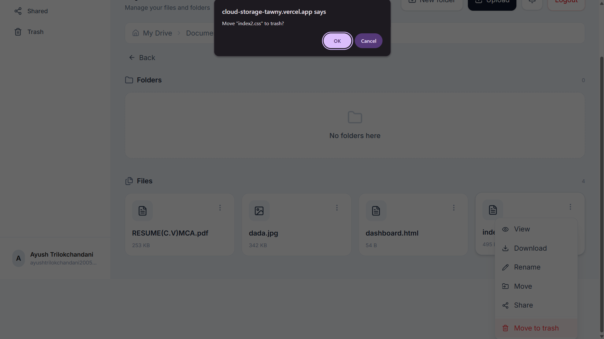
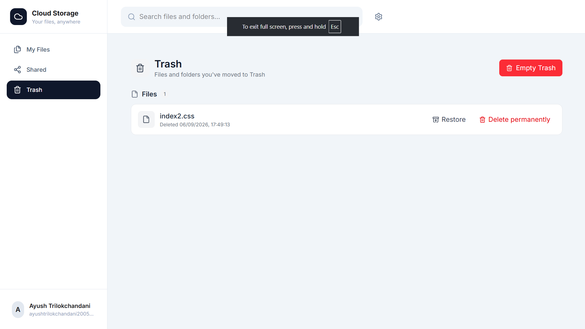

---

## 🛠️ Technologies Used

### Frontend

* React
* Vite
* JavaScript
* Tailwind CSS
* Lucide React
* Fetch API

### Backend

* Python
* FastAPI
* SQLAlchemy
* Pydantic
* JWT Authentication
* pwdlib

### Database & Cloud Storage

* Neon — PostgreSQL cloud database
* Cloudinary — Cloud file and media storage

### Deployment

* Vercel — Frontend deployment
* Render — Backend deployment

---

## 📂 Folder Structure

```text
Cloud-Storage-App/
│
├── frontend/
│   ├── src/
│   │   ├── components/
│   │   ├── pages/
│   │   ├── context/
│   │   ├── services/
│   │   └── ...
│   ├── public/
│   ├── package.json
│   └── ...
│
├── backend/
│   ├── app/
│   │   ├── core/
│   │   ├── models/
│   │   ├── routes/
│   │   ├── schemas/
│   │   └── ...
│   ├── requirements.txt
│   └── ...
│
└── screenshots/
    ├── login.png
    ├── register.png
    ├── dashboard.png
    ├── file-actions.png
    ├── folder-actions.png
    ├── share-file.png
    ├── shared-files.png
    ├── public-link.png
    ├── notifications.png
    └── trash.png
```

---

## 🏢 Industrial Use

This project demonstrates practical concepts used in real-world cloud storage and collaboration platforms, including secure authentication, cloud file storage, folder management, role-based access, file sharing, public access links, REST APIs, database management, and cloud deployment.

It can be extended for document management systems, team collaboration platforms, educational file-sharing systems, business file management platforms, and personal cloud storage applications.

---

## ✅ Conclusion

The Cloud Storage Application demonstrates a complete full-stack workflow covering authentication, database management, cloud storage, file and folder management, sharing, permissions, public access, REST APIs, and cloud deployment.

It provides a practical foundation for building secure and scalable cloud-based file management and collaboration systems.
